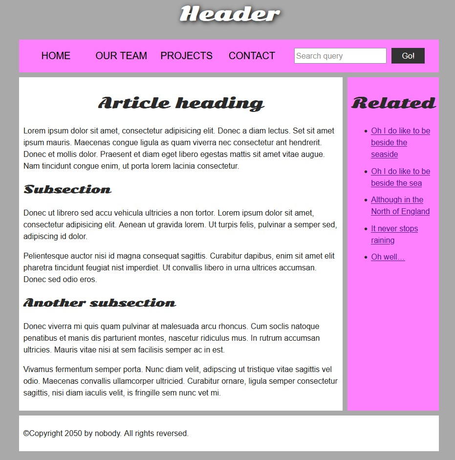

download html_errors2.html en geen_errors2.css. Beide bestanden moeten in een (1) map zitten.

html_errors2.html bevat fouten, probeer die uit de code te halen.

De website moet er als volgt uitzien: 
